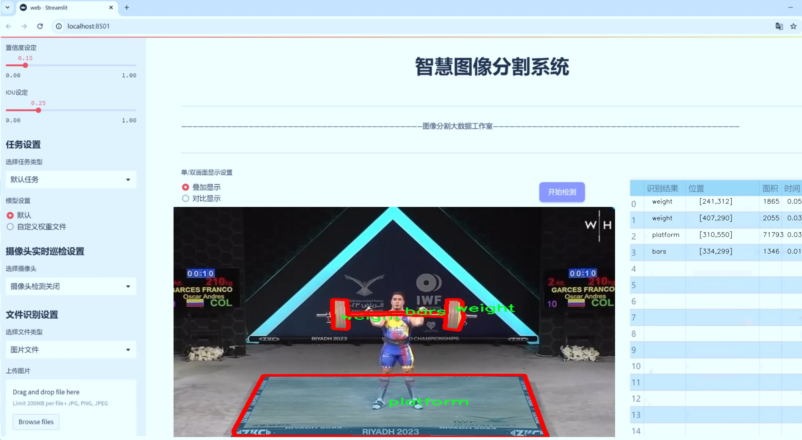
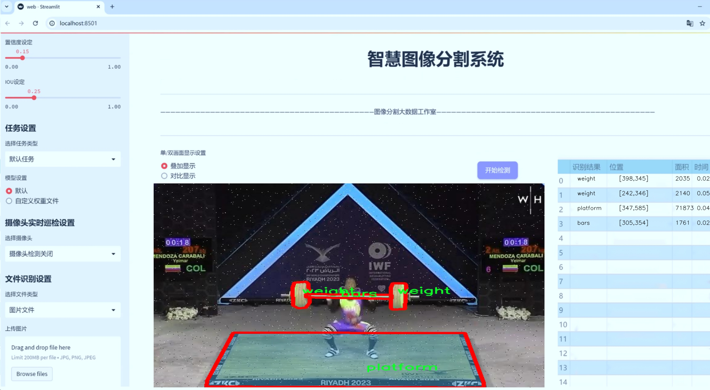
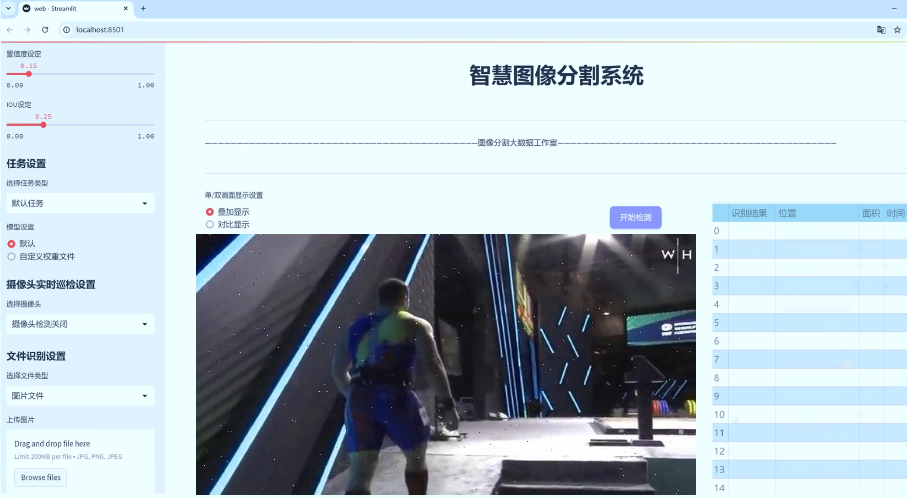
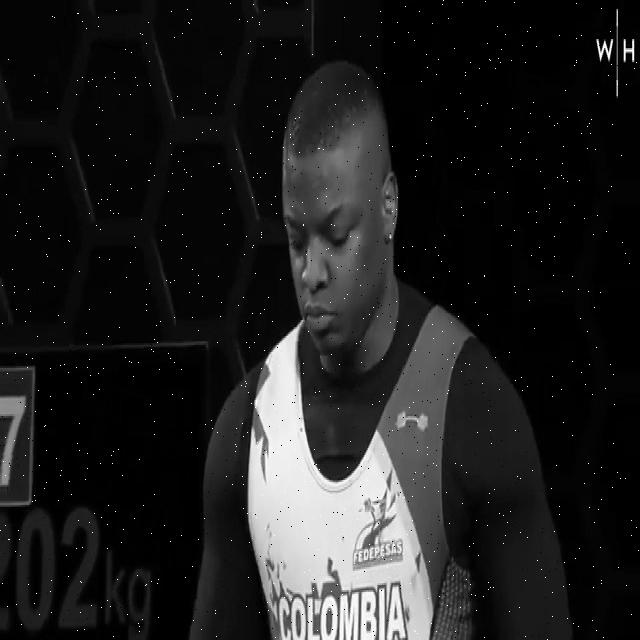
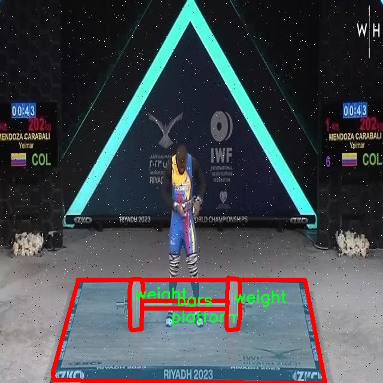
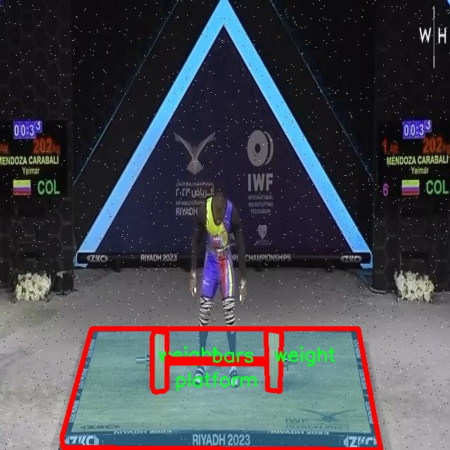
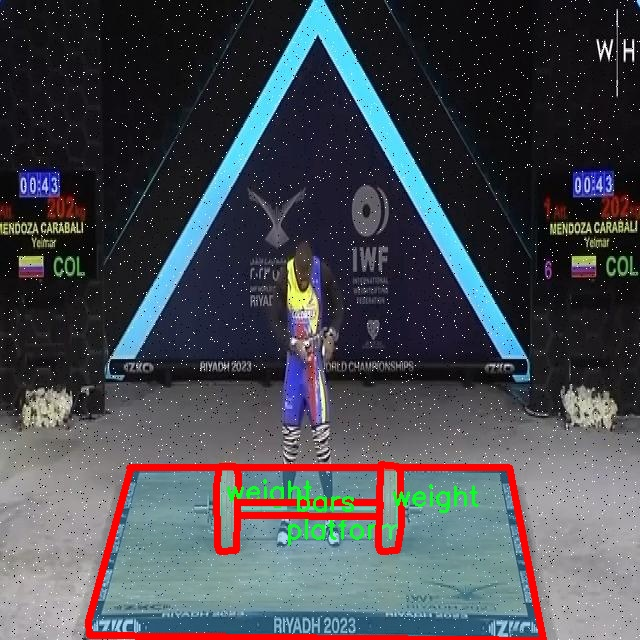
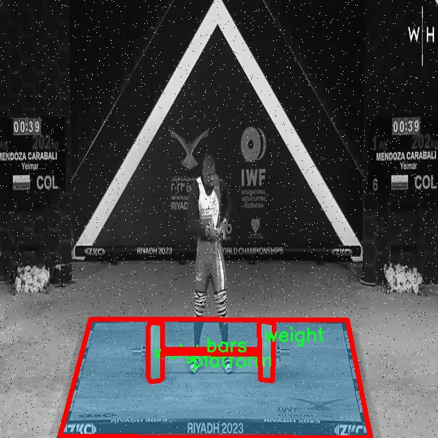

# 举重场景哑铃图像分割系统源码＆数据集分享
 [yolov8-seg-GhostHGNetV2＆yolov8-seg-EfficientHead等50+全套改进创新点发刊_一键训练教程_Web前端展示]

### 1.研究背景与意义

项目参考[ILSVRC ImageNet Large Scale Visual Recognition Challenge](https://gitee.com/YOLOv8_YOLOv11_Segmentation_Studio/projects)

项目来源[AAAI Global Al lnnovation Contest](https://kdocs.cn/l/cszuIiCKVNis)

研究背景与意义

随着健身行业的蓬勃发展，举重作为一种重要的力量训练形式，越来越受到人们的关注。举重不仅能够增强肌肉力量，提高身体素质，还能够有效改善心肺功能，促进身体健康。然而，传统的举重训练往往依赖于教练的指导和个人的自我感知，缺乏科学的监测和分析手段。因此，基于计算机视觉的图像分割技术在举重训练中的应用显得尤为重要。通过对举重场景中的哑铃图像进行精确分割，可以为运动员提供实时的反馈，帮助他们更好地掌握训练技巧，降低受伤风险。

YOLO（You Only Look Once）系列模型作为一种高效的目标检测算法，近年来在图像分割领域取得了显著的进展。特别是YOLOv8模型，其在速度和精度上都表现出色，适合实时应用。通过对YOLOv8进行改进，结合举重场景的特定需求，可以实现对哑铃、杠铃和平台等重要元素的精准识别与分割。这不仅能够提升图像处理的效率，还能为后续的运动分析和训练效果评估提供可靠的数据支持。

本研究所使用的数据集“Weightlifting Judge 2.0”包含1000张图像，涵盖了3个类别：杠铃、平台和哑铃。这些数据的多样性和丰富性为模型的训练和验证提供了坚实的基础。通过对这些图像进行深入分析，我们可以探索不同的训练姿势、器械使用情况以及环境因素对运动表现的影响。这一过程不仅有助于提升运动员的训练效果，还能够为教练提供科学的指导依据，推动举重训练的专业化和系统化发展。

此外，图像分割技术在举重场景中的应用，能够为智能健身设备的研发提供重要的技术支持。随着人工智能和物联网技术的快速发展，未来的健身器材将越来越多地集成智能化功能。通过实时监测和分析运动员的训练状态，智能健身设备能够提供个性化的训练方案，帮助运动员更有效地达到训练目标。这不仅提升了训练的科学性和安全性，也为健身行业的创新发展开辟了新的方向。

综上所述，基于改进YOLOv8的举重场景哑铃图像分割系统的研究，不仅具有重要的学术价值，还有着广泛的应用前景。通过深入探讨图像分割技术在举重训练中的应用，我们能够为运动员提供更为精准的训练指导，推动健身行业的智能化发展。同时，该研究也为计算机视觉领域的进一步探索提供了新的思路，促进了多学科交叉研究的深入开展。因此，本研究的开展具有重要的理论意义和实际应用价值。

### 2.图片演示







##### 注意：由于此博客编辑较早，上面“2.图片演示”和“3.视频演示”展示的系统图片或者视频可能为老版本，新版本在老版本的基础上升级如下：（实际效果以升级的新版本为准）

  （1）适配了YOLOV8的“目标检测”模型和“实例分割”模型，通过加载相应的权重（.pt）文件即可自适应加载模型。

  （2）支持“图片识别”、“视频识别”、“摄像头实时识别”三种识别模式。

  （3）支持“图片识别”、“视频识别”、“摄像头实时识别”三种识别结果保存导出，解决手动导出（容易卡顿出现爆内存）存在的问题，识别完自动保存结果并导出到tempDir中。

  （4）支持Web前端系统中的标题、背景图等自定义修改，后面提供修改教程。

  另外本项目提供训练的数据集和训练教程,暂不提供权重文件（best.pt）,需要您按照教程进行训练后实现图片演示和Web前端界面演示的效果。

### 3.视频演示

[3.1 视频演示](https://www.bilibili.com/video/BV1fpSCYDEyi/)

### 4.数据集信息展示

##### 4.1 本项目数据集详细数据（类别数＆类别名）

nc: 3
names: ['bars', 'platform', 'weight']


##### 4.2 本项目数据集信息介绍

数据集信息展示

在进行改进YOLOv8-seg的举重场景哑铃图像分割系统的研究中，所使用的数据集名为“Weightlifting Judge 2.0”。该数据集专门针对举重运动的特定场景进行了精心设计，旨在为图像分割任务提供高质量的训练样本，以提高模型在实际应用中的表现。数据集的类别数量为3，具体类别包括“bars”（杠铃）、“platform”（举重平台）和“weight”（哑铃）。这些类别的选择不仅反映了举重运动的基本构成要素，还为模型提供了丰富的上下文信息，使其能够更好地理解和分割图像中的重要元素。

“Weightlifting Judge 2.0”数据集的构建过程考虑到了多样性和代表性，包含了不同角度、光照条件和背景环境下的举重场景图像。这种多样性确保了模型在面对各种实际情况时的鲁棒性和适应性。数据集中每个类别的样本均经过精确标注，确保了训练数据的高质量。这种精确的标注不仅有助于模型学习到各个类别的特征，还能提高其在复杂场景下的分割精度。

在图像分割任务中，模型需要能够识别并分离出图像中的不同对象。在“Weightlifting Judge 2.0”数据集中，杠铃、举重平台和哑铃作为主要对象，各自具有独特的形状和特征。例如，杠铃通常呈现为长条形状，平台则是一个平坦的区域，而哑铃则是相对较小且对称的物体。这些特征的多样性为模型提供了丰富的学习材料，使其能够在分割过程中更好地捕捉到物体的边界和形状。

此外，数据集的设计还考虑到了不同训练阶段的需求。在初始阶段，模型可能需要更多的基础样本以学习基本特征，而在后续的精细化训练中，则可以引入更复杂的场景和多样化的背景，以提升模型的分割能力。因此，数据集中的样本数量和种类经过精心挑选，以确保模型在各个阶段都能获得适当的训练数据。

在实际应用中，改进YOLOv8-seg的举重场景哑铃图像分割系统将能够在运动员训练、比赛评估和技术分析等多个领域发挥重要作用。通过高效的图像分割，系统能够实时识别和跟踪运动员的动作，分析其举重技术，并提供针对性的反馈。这不仅有助于提升运动员的训练效果，还能为教练和裁判提供科学依据，促进举重运动的规范化和专业化发展。

综上所述，“Weightlifting Judge 2.0”数据集为改进YOLOv8-seg的举重场景哑铃图像分割系统提供了坚实的基础。通过对该数据集的深入研究和分析，模型将能够在实际应用中展现出卓越的性能，为举重运动的各个方面带来积极的影响。











### 5.全套项目环境部署视频教程（零基础手把手教学）

[5.1 环境部署教程链接（零基础手把手教学）](https://www.bilibili.com/video/BV1jG4Ve4E9t/?vd_source=bc9aec86d164b67a7004b996143742dc)


[5.2 安装Python虚拟环境创建和依赖库安装视频教程链接（零基础手把手教学）](https://www.bilibili.com/video/BV1nA4VeYEze/?vd_source=bc9aec86d164b67a7004b996143742dc)

### 6.手把手YOLOV8-seg训练视频教程（零基础小白有手就能学会）

[6.1 手把手YOLOV8-seg训练视频教程（零基础小白有手就能学会）](https://www.bilibili.com/video/BV1cA4VeYETe/?vd_source=bc9aec86d164b67a7004b996143742dc)


按照上面的训练视频教程链接加载项目提供的数据集，运行train.py即可开始训练



     Epoch   gpu_mem       box       obj       cls    labels  img_size
     1/200     0G   0.01576   0.01955  0.007536        22      1280: 100%|██████████| 849/849 [14:42<00:00,  1.04s/it]
               Class     Images     Labels          P          R     mAP@.5 mAP@.5:.95: 100%|██████████| 213/213 [01:14<00:00,  2.87it/s]
                 all       3395      17314      0.994      0.957      0.0957      0.0843

     Epoch   gpu_mem       box       obj       cls    labels  img_size
     2/200     0G   0.01578   0.01923  0.007006        22      1280: 100%|██████████| 849/849 [14:44<00:00,  1.04s/it]
               Class     Images     Labels          P          R     mAP@.5 mAP@.5:.95: 100%|██████████| 213/213 [01:12<00:00,  2.95it/s]
                 all       3395      17314      0.996      0.956      0.0957      0.0845

     Epoch   gpu_mem       box       obj       cls    labels  img_size
     3/200     0G   0.01561    0.0191  0.006895        27      1280: 100%|██████████| 849/849 [10:56<00:00,  1.29it/s]
               Class     Images     Labels          P          R     mAP@.5 mAP@.5:.95: 100%|███████   | 187/213 [00:52<00:00,  4.04it/s]
                 all       3395      17314      0.996      0.957      0.0957      0.0845


### 7.50+种全套YOLOV8-seg创新点代码加载调参视频教程（一键加载写好的改进模型的配置文件）

[7.1 50+种全套YOLOV8-seg创新点代码加载调参视频教程（一键加载写好的改进模型的配置文件）](https://www.bilibili.com/video/BV1Hw4VePEXv/?vd_source=bc9aec86d164b67a7004b996143742dc)

### 8.YOLOV8-seg图像分割算法原理

原始YOLOv8-seg算法原理

YOLOv8-seg算法是YOLO系列目标检测模型的最新版本，基于YOLOv7的架构进行了深度优化，旨在实现更高效的目标检测和分割任务。其核心思想是通过改进的卷积神经网络结构，直接在输入图像上进行目标检测和分割，而不依赖于传统的滑动窗口或区域提议方法。这种设计使得YOLOv8-seg在速度和精度上都取得了显著的提升，适用于智能监控、自动驾驶、医疗影像分析等多个领域。

在YOLOv8-seg中，网络结构主要由输入层、主干网络、颈部网络和头部网络组成。输入层负责对图像进行预处理和缩放，以适应模型的输入要求。主干网络则是整个模型的特征提取部分，其设计采用了更深的卷积层，结合了批归一化和SiLU激活函数，以增强模型的非线性表达能力。特别值得注意的是，YOLOv8-seg引入了C2F模块，这一模块替代了传统的C3模块，通过3×3的卷积操作和深度为3的设计，显著减小了模型的参数量，从而实现了轻量化。

在特征提取过程中，YOLOv8-seg通过深度卷积层的堆叠，逐步提取图像的高层语义特征。这些特征在经过多个卷积层的处理后，能够有效捕捉到目标的形状、纹理等信息。为了进一步增强特征的表达能力，YOLOv8-seg在主干网络的末尾引入了SPP（Spatial Pyramid Pooling）模块，通过多个尺度的最大池化操作，提升了模型对多尺度特征的抽象能力。这一设计使得YOLOv8-seg能够在不同尺度的目标检测中表现出色，尤其是在处理复杂场景时。

颈部网络是YOLOv8-seg的另一个关键组成部分，主要负责融合来自主干网络的多尺度特征。该部分结合了特征金字塔网络（FPN）和路径聚合网络（PAN）的优点，通过层间的特征融合，提升了模型对不同尺度特征的提取和利用效率。FPN的引入使得YOLOv8-seg能够有效地处理图像中的小目标，而PAN则通过跨层连接，增强了特征信息的流动性，进一步提高了模型的鲁棒性。

在头部网络中，YOLOv8-seg采用了解耦的检测头设计。这一设计通过两个并行的卷积分支，分别计算目标的回归和分类损失，进而实现更为精确的目标定位和分类。这种解耦的方式不仅提高了模型的训练效率，还有效减少了目标检测中的误差，使得YOLOv8-seg在复杂场景下的表现更加稳定。

值得一提的是，YOLOv8-seg还引入了BiFPN（Bidirectional Feature Pyramid Network）结构，以进一步提升特征融合的效率。BiFPN通过高效的双向跨尺度连接和加权特征融合，优化了特征信息的整合过程。该结构通过删除单输入对应的节点，并在同一层的输入输出节点之间添加连接，极大地提高了特征提取的速度和准确性。这一创新使得YOLOv8-seg在处理不同尺度的目标时，能够更快速地响应，并且在复杂场景中表现出更强的适应能力。

在训练过程中，YOLOv8-seg采用了多尺度训练和测试策略，通过对输入图像进行不同尺寸的缩放，增强了模型的泛化能力。此外，YOLOv8-seg还结合了数据增强技术，如随机裁剪、翻转和颜色变换等，以提高模型在真实场景中的鲁棒性。这些技术的结合，使得YOLOv8-seg在面对多变的环境时，依然能够保持高效的检测性能。

综上所述，YOLOv8-seg算法通过对网络结构的深度优化和创新设计，显著提升了目标检测和分割的性能。其轻量化的特征提取模块、有效的特征融合策略以及解耦的检测头设计，使得YOLOv8-seg在速度和精度上都取得了优异的表现。这一算法的推出，不仅为目标检测领域带来了新的技术突破，也为实际应用提供了更为强大的工具，推动了智能监控、自动驾驶等领域的发展。随着YOLOv8-seg的不断优化和应用推广，未来在更多复杂场景中的应用潜力将更加广阔。


### 9.系统功能展示（检测对象为举例，实际内容以本项目数据集为准）

图9.1.系统支持检测结果表格显示

  图9.2.系统支持置信度和IOU阈值手动调节

  图9.3.系统支持自定义加载权重文件best.pt(需要你通过步骤5中训练获得)

  图9.4.系统支持摄像头实时识别

  图9.5.系统支持图片识别

  图9.6.系统支持视频识别

  图9.7.系统支持识别结果文件自动保存

  图9.8.系统支持Excel导出检测结果数据


### 10.50+种全套YOLOV8-seg创新点原理讲解（非科班也可以轻松写刊发刊，V11版本正在科研待更新）

#### 10.1 由于篇幅限制，每个创新点的具体原理讲解就不一一展开，具体见下列网址中的创新点对应子项目的技术原理博客网址【Blog】：


[10.1 50+种全套YOLOV8-seg创新点原理讲解链接](https://gitee.com/qunmasj/good)

#### 10.2 部分改进模块原理讲解(完整的改进原理见上图和技术博客链接)【如果此小节的图加载失败可以通过CSDN或者Github搜索该博客的标题访问原始博客，原始博客图片显示正常】
### YOLOv8简介
#### Yolov8网络模型
Yolov8n的网络分为输入端、主干网( Back-bone) 、Neck模块和输出端4个部分（图4)。输
人端主要有马赛克( Mosaic）数据增强、自适应锚框计算和自适应灰度填充。主干网有Conv、C2和SPPF结构，其中，C2r模块是对残差特征进行学习的主要模块，该模块仿照Yolov7的ELAN结构,通过更多的分支跨层连接，丰富了模型的梯度流，可形成一个具有更强特征表示能力的神经网络模
块。Neck模块采用PAN ( path aggregation nelwOrk ,结构，可加强网络对不同缩放尺度对象特征融合的
能力。输出端将分类和检测过程进行解耦，主要包括损失计算和目标检测框筛选，其中，损失计算过程主要包括正负样本分配策略和 Loss计算，Yolov8n 网络主要使用TaskAlignedAssignerl 10]方法，即根据分类与回归的分数加权结果选择正样本;Loss计算包括分类和回归2个分支，无Ob-jecIness分支。分类分支依然采用BCE Loss，回归分支则使用了Distribution Focal Loss!11〕和CIOU( complele inlersection over union)损失函数。

### 可扩张残差（DWR）注意力模块
当前的许多工作直接采用多速率深度扩张卷积从一个输入特征图中同时捕获多尺度上下文信息，从而提高实时语义分割的特征提取效率。 然而，这种设计可能会因为结构和超参数的不合理而导致多尺度上下文信息的访问困难。 为了降低绘制多尺度上下文信息的难度，我们提出了一种高效的多尺度特征提取方法，该方法分解了原始的单步特征提取方法方法分为两个步骤，区域残差-语义残差。 在该方法中，多速率深度扩张卷积在特征提取中发挥更简单的作用：根据第一步提供的每个简明区域形式特征图，在第二步中使用一个所需的感受野执行简单的基于语义的形态过滤 一步，提高他们的效率。 此外，扩张率和扩张卷积的容量每个网络阶段都经过精心设计，以充分利用所有可以实现的区域形式的特征图。 因此，我们分别为高层和低层网络设计了一种新颖的扩张式残差（DWR）模块和简单倒置残差（SIR）模块。


首先，该博客引入了一个Dilation-wise Residual（DWR）模块，用于提取网络高层的特征，如图2a所示。多分支结构用于扩展感受野，其中每个分支采用不同空洞率的空洞深度卷积。
然后，专门设计了一个Simple Inverted Residual（SIR）模块来提取网络低层的特征，如图2b所示。该模块仅具有3×3的微小感受野，但使用inverted bottleneck式结构来扩展通道数量，确保更强的特征提取能力。
最后，基于DWR和SIR模块，构建了一个编码器-解码器风格的网络DWRSeg，其中解码器采用了简单的类似FCN的结构。解码器使用来自最后两个阶段的强语义信息直接对特征图进行上采样，然后将它们与来自较低阶段的特征图（包含丰富的详细信息）拼接起来，以进行最终预测。


### 11.项目核心源码讲解（再也不用担心看不懂代码逻辑）

#### 11.1 ultralytics\models\sam\modules\tiny_encoder.py

以下是对给定代码的核心部分进行分析和详细注释的结果。代码主要实现了一个名为 `TinyViT` 的视觉模型架构，结合了卷积和自注意力机制。以下是精简后的核心代码及其注释：

```python
import torch
import torch.nn as nn
import torch.nn.functional as F

class Conv2d_BN(nn.Sequential):
    """执行2D卷积并随后进行批量归一化的顺序容器。"""
    def __init__(self, in_channels, out_channels, kernel_size=1, stride=1, padding=0):
        super().__init__()
        # 添加卷积层
        self.add_module('conv', nn.Conv2d(in_channels, out_channels, kernel_size, stride, padding, bias=False))
        # 添加批量归一化层
        self.add_module('bn', nn.BatchNorm2d(out_channels))

class PatchEmbed(nn.Module):
    """将图像嵌入为补丁并投影到指定的嵌入维度。"""
    def __init__(self, in_chans, embed_dim, resolution):
        super().__init__()
        # 计算补丁的分辨率
        img_size = (resolution // 4, resolution // 4)
        self.seq = nn.Sequential(
            Conv2d_BN(in_chans, embed_dim // 2, kernel_size=3, stride=2, padding=1),
            nn.GELU(),
            Conv2d_BN(embed_dim // 2, embed_dim, kernel_size=3, stride=2, padding=1),
        )

    def forward(self, x):
        """将输入张量 'x' 通过补丁嵌入模型的操作序列。"""
        return self.seq(x)

class MBConv(nn.Module):
    """移动反向瓶颈卷积层，属于EfficientNet架构的一部分。"""
    def __init__(self, in_chans, out_chans, expand_ratio):
        super().__init__()
        self.conv1 = Conv2d_BN(in_chans, in_chans * expand_ratio, kernel_size=1)
        self.conv2 = Conv2d_BN(in_chans * expand_ratio, in_chans * expand_ratio, kernel_size=3, padding=1, groups=in_chans * expand_ratio)
        self.conv3 = Conv2d_BN(in_chans * expand_ratio, out_chans, kernel_size=1, bn_weight_init=0.0)

    def forward(self, x):
        """实现模型架构的前向传播。"""
        shortcut = x
        x = self.conv1(x)
        x = self.conv2(x)
        x = self.conv3(x)
        return x + shortcut  # 残差连接

class Attention(nn.Module):
    """多头注意力模块，支持空间感知。"""
    def __init__(self, dim, key_dim, num_heads):
        super().__init__()
        self.num_heads = num_heads
        self.scale = key_dim ** -0.5
        self.qkv = nn.Linear(dim, dim * 3)  # 生成查询、键、值

    def forward(self, x):
        """执行前向传播，计算注意力。"""
        B, N, _ = x.shape
        qkv = self.qkv(x).view(B, N, 3, self.num_heads, -1).transpose(2, 3)  # (B, N, 3, num_heads, head_dim)
        q, k, v = qkv.unbind(2)  # 分离查询、键、值
        attn = (q @ k.transpose(-2, -1)) * self.scale
        attn = attn.softmax(dim=-1)
        return (attn @ v).transpose(1, 2).reshape(B, N, -1)  # 返回加权后的值

class TinyViTBlock(nn.Module):
    """TinyViT块，应用自注意力和局部卷积。"""
    def __init__(self, dim, num_heads):
        super().__init__()
        self.attn = Attention(dim, dim // num_heads, num_heads)
        self.local_conv = Conv2d_BN(dim, dim, kernel_size=3, padding=1)

    def forward(self, x):
        """应用注意力和局部卷积到输入 'x'。"""
        x = self.attn(x)  # 应用注意力
        x = x.view(x.size(0), x.size(1), -1).permute(0, 2, 1)  # 调整形状以适应卷积
        x = self.local_conv(x)  # 应用局部卷积
        return x

class TinyViT(nn.Module):
    """TinyViT架构用于视觉任务。"""
    def __init__(self, img_size=224, in_chans=3, num_classes=1000):
        super().__init__()
        self.patch_embed = PatchEmbed(in_chans, embed_dim=96, resolution=img_size)
        self.layers = nn.ModuleList([
            TinyViTBlock(dim=96, num_heads=3),
            TinyViTBlock(dim=192, num_heads=6),
            TinyViTBlock(dim=384, num_heads=12),
            TinyViTBlock(dim=768, num_heads=24),
        ])
        self.head = nn.Linear(768, num_classes)  # 分类头

    def forward(self, x):
        """执行前向传播，处理输入张量。"""
        x = self.patch_embed(x)  # 嵌入补丁
        for layer in self.layers:
            x = layer(x)  # 通过每一层
        return self.head(x)  # 返回分类结果
```

### 代码分析
1. **卷积和批量归一化**：`Conv2d_BN` 类实现了卷积和批量归一化的组合，为后续的网络层提供了基础。
2. **补丁嵌入**：`PatchEmbed` 类将输入图像分割成补丁并进行嵌入，减少了后续计算的复杂度。
3. **MBConv**：`MBConv` 类实现了高效的卷积操作，采用了残差连接以增强特征的流动性。
4. **注意力机制**：`Attention` 类实现了多头注意力机制，能够在不同的特征子空间中捕捉信息。
5. **TinyViT块**：`TinyViTBlock` 类结合了注意力机制和局部卷积，形成了TinyViT的基本构建块。
6. **TinyViT模型**：`TinyViT` 类整合了上述组件，构建了完整的视觉模型，能够处理图像并进行分类。

这些核心部分构成了TinyViT模型的基础架构，适用于各种视觉任务。

这个文件实现了一个名为TinyViT的视觉模型架构，主要用于图像分类等视觉任务。TinyViT结合了卷积神经网络（CNN）和变换器（Transformer）的优点，采用了一系列的模块来处理输入图像。

首先，文件导入了一些必要的库，包括PyTorch的核心模块和一些实用工具。接着，定义了一些基本的构建块，例如Conv2d_BN类，它是一个顺序容器，执行2D卷积操作并随后进行批量归一化。这个类在后续的模块中被广泛使用，以提高模型的稳定性和收敛速度。

PatchEmbed类负责将输入图像分割成小块，并将这些小块投影到指定的嵌入维度。这一过程是通过一系列卷积层实现的，最终生成的特征图将用于后续的处理。

MBConv类实现了移动反向瓶颈卷积层，这是EfficientNet架构的一部分。该层通过一系列卷积和激活函数的组合来处理输入特征，并使用短路连接来增强信息流动。

PatchMerging类则负责合并相邻的特征块，并将其投影到新的维度，这对于处理高维特征图非常重要。

ConvLayer类是一个包含多个MBConv层的卷积层，可以选择性地对输出进行下采样，并支持梯度检查点以节省内存。

Mlp类实现了多层感知机（MLP），用于Transformer架构中的前馈网络。它包括层归一化和两个全连接层。

Attention类实现了多头注意力机制，支持空间感知，通过在空间分辨率上应用注意力偏置来增强模型的表现。该类还实现了可训练的注意力偏置，以便在训练过程中进行优化。

TinyViTBlock类是TinyViT的基本构建块，结合了自注意力机制和局部卷积操作。它通过局部卷积增强了模型对局部特征的捕捉能力。

BasicLayer类则是TinyViT架构中的一个基本层，包含多个TinyViTBlock，并在必要时进行下采样。

LayerNorm2d类实现了2D层归一化，用于对特征图进行归一化处理，以提高模型的稳定性。

TinyViT类是整个模型的核心，定义了模型的输入尺寸、通道数、类别数以及各层的嵌入维度、深度、头数和窗口大小等超参数。模型的前向传播过程首先通过PatchEmbed进行特征提取，然后通过多个层进行处理，最后通过分类头输出结果。

整个模型的设计考虑了可扩展性和灵活性，允许用户根据需求调整各层的参数，从而构建不同配置的TinyViT模型。通过这种方式，TinyViT能够在保持较小模型尺寸的同时，提供强大的视觉特征提取能力。

#### 11.2 ultralytics\utils\atss.py

以下是经过简化和注释的核心代码部分，主要保留了生成锚框和计算IoU的功能。

```python
import torch
import torch.nn as nn
import torch.nn.functional as F

def generate_anchors(feats, fpn_strides, grid_cell_size=5.0, grid_cell_offset=0.5, device='cpu', is_eval=False, mode='af'):
    '''根据特征生成锚框。'''
    anchors = []  # 存储锚框
    anchor_points = []  # 存储锚点
    stride_tensor = []  # 存储步幅
    num_anchors_list = []  # 存储每层的锚框数量

    assert feats is not None  # 确保特征不为空

    # 评估模式
    if is_eval:
        for i, stride in enumerate(fpn_strides):
            _, _, h, w = feats[i].shape  # 获取特征图的高度和宽度
            shift_x = torch.arange(end=w, device=device) + grid_cell_offset  # 计算x方向的偏移
            shift_y = torch.arange(end=h, device=device) + grid_cell_offset  # 计算y方向的偏移
            shift_y, shift_x = torch.meshgrid(shift_y, shift_x, indexing='ij')  # 创建网格
            anchor_point = torch.stack([shift_x, shift_y], axis=-1).to(torch.float)  # 生成锚点

            if mode == 'af':  # anchor-free模式
                anchor_points.append(anchor_point.reshape([-1, 2]))  # 将锚点展平
                stride_tensor.append(torch.full((h * w, 1), stride, dtype=torch.float, device=device))  # 生成步幅张量
            elif mode == 'ab':  # anchor-based模式
                anchor_points.append(anchor_point.reshape([-1, 2]).repeat(3, 1))  # 重复锚点
                stride_tensor.append(torch.full((h * w, 1), stride, dtype=torch.float, device=device).repeat(3, 1))  # 重复步幅

        anchor_points = torch.cat(anchor_points)  # 合并锚点
        stride_tensor = torch.cat(stride_tensor)  # 合并步幅
        return anchor_points, stride_tensor  # 返回锚点和步幅

    # 训练模式
    else:
        for i, stride in enumerate(fpn_strides):
            _, _, h, w = feats[i].shape  # 获取特征图的高度和宽度
            cell_half_size = grid_cell_size * stride * 0.5  # 计算锚框的一半大小
            shift_x = (torch.arange(end=w, device=device) + grid_cell_offset) * stride  # 计算x方向的偏移
            shift_y = (torch.arange(end=h, device=device) + grid_cell_offset) * stride  # 计算y方向的偏移
            shift_y, shift_x = torch.meshgrid(shift_y, shift_x, indexing='ij')  # 创建网格

            # 生成锚框
            anchor = torch.stack(
                [
                    shift_x - cell_half_size, shift_y - cell_half_size,
                    shift_x + cell_half_size, shift_y + cell_half_size
                ],
                axis=-1).clone().to(feats[0].dtype)

            anchor_point = torch.stack([shift_x, shift_y], axis=-1).clone().to(feats[0].dtype)  # 生成锚点

            if mode == 'af':  # anchor-free模式
                anchors.append(anchor.reshape([-1, 4]))  # 将锚框展平
                anchor_points.append(anchor_point.reshape([-1, 2]))  # 将锚点展平
            elif mode == 'ab':  # anchor-based模式
                anchors.append(anchor.reshape([-1, 4]).repeat(3, 1))  # 重复锚框
                anchor_points.append(anchor_point.reshape([-1, 2]).repeat(3, 1))  # 重复锚点

            num_anchors_list.append(len(anchors[-1]))  # 记录当前层的锚框数量
            stride_tensor.append(torch.full([num_anchors_list[-1], 1], stride, dtype=feats[0].dtype))  # 生成步幅张量

        anchors = torch.cat(anchors)  # 合并锚框
        anchor_points = torch.cat(anchor_points).to(device)  # 合并锚点并转移到指定设备
        stride_tensor = torch.cat(stride_tensor).to(device)  # 合并步幅并转移到指定设备
        return anchors, anchor_points, num_anchors_list, stride_tensor  # 返回锚框、锚点、锚框数量和步幅

def bbox_overlaps(bboxes1, bboxes2, mode='iou', is_aligned=False, eps=1e-6):
    """计算两个bbox集合之间的重叠度（IoU）。"""
    assert mode in ['iou', 'iof', 'giou'], f'Unsupported mode {mode}'  # 确保模式有效
    assert (bboxes1.size(-1) == 4 or bboxes1.size(0) == 0)  # 确保bboxes1有效
    assert (bboxes2.size(-1) == 4 or bboxes2.size(0) == 0)  # 确保bboxes2有效

    # 获取批次维度
    assert bboxes1.shape[:-2] == bboxes2.shape[:-2]
    batch_shape = bboxes1.shape[:-2]

    rows = bboxes1.size(-2)  # bboxes1的数量
    cols = bboxes2.size(-2)  # bboxes2的数量
    if is_aligned:
        assert rows == cols  # 如果对齐，数量必须相等

    if rows * cols == 0:  # 如果没有框
        if is_aligned:
            return bboxes1.new(batch_shape + (rows, ))  # 返回空张量
        else:
            return bboxes1.new(batch_shape + (rows, cols))  # 返回空张量

    # 计算面积
    area1 = (bboxes1[..., 2] - bboxes1[..., 0]) * (bboxes1[..., 3] - bboxes1[..., 1])
    area2 = (bboxes2[..., 2] - bboxes2[..., 0]) * (bboxes2[..., 3] - bboxes2[..., 1])

    # 计算重叠区域
    lt = torch.max(bboxes1[..., :2], bboxes2[..., :2])  # 左上角
    rb = torch.min(bboxes1[..., 2:], bboxes2[..., 2:])  # 右下角
    wh = (rb - lt).clamp(min=0)  # 宽高
    overlap = wh[..., 0] * wh[..., 1]  # 重叠面积

    # 计算联合面积
    union = area1 + area2 - overlap + eps  # 加上eps以避免除零
    ious = overlap / union  # 计算IoU

    return ious  # 返回IoU
```

### 代码注释说明
1. **generate_anchors**: 该函数根据输入特征生成锚框。支持评估模式和训练模式，分别处理不同的锚框生成逻辑。
2. **bbox_overlaps**: 该函数计算两个边界框集合之间的重叠度（IoU）。支持不同的计算模式（IoU、IoF、GIoU），并处理对齐和非对齐的情况。通过计算面积和重叠区域来实现。

这个程序文件 `ultralytics/utils/atss.py` 实现了自适应训练样本选择分配器（ATSS Assigner），用于目标检测任务中的锚框分配。程序中包含多个函数和一个类，主要功能包括生成锚框、计算框之间的重叠度、计算距离、以及进行锚框的分配。

首先，`generate_anchors` 函数根据特征图生成锚框。它接受特征图、特征图的步幅、网格单元大小、设备类型等参数。根据不同的模式（锚基或锚自由），该函数计算锚框的坐标并返回锚框和相关的步幅信息。在评估模式下，生成的锚框仅为点坐标，而在训练模式下则生成包含宽高的框。

接下来，`bbox_overlaps` 函数用于计算两个边界框集合之间的重叠度，支持多种重叠度计算模式（如 IoU、IoF 和 GIoU）。该函数通过计算每对框的交集和并集来实现重叠度的计算，并在计算过程中考虑了数值稳定性。

`dist_calculator` 函数计算每个真实框与所有锚框之间的中心距离，并返回距离矩阵和锚框的中心点。`iou_calculator` 函数则计算批量边界框的 IoU 值，支持不同的输入格式。

`ATSSAssigner` 类是该文件的核心部分，继承自 `nn.Module`。它的构造函数初始化了一些参数，包括顶级候选框数量和类别数量。在 `forward` 方法中，该类实现了锚框的分配逻辑。它首先计算真实框与锚框之间的重叠度和距离，然后选择距离最近的候选框，并根据重叠度阈值选择正样本。最后，返回目标标签、目标框、目标分数和前景掩码。

在 `select_topk_candidates` 方法中，根据距离选择前 K 个候选框，并处理掩码。`thres_calculator` 方法计算每个真实框的重叠度阈值。`get_targets` 方法则根据选择的目标框和标签生成最终的目标输出。

整个程序的设计旨在提高目标检测模型的训练效率，通过自适应选择样本来优化锚框的分配，使得模型能够更好地学习到目标的特征。

#### 11.3 ultralytics\utils\checks.py

以下是经过简化和注释的核心代码部分，主要保留了与版本检查、依赖检查和环境检测相关的功能：

```python
import os
import platform
import re
import subprocess
import sys
from pathlib import Path
from typing import Optional
import requests
import torch
from ultralytics.utils import LOGGER, ROOT, SimpleNamespace

def parse_requirements(file_path=ROOT.parent / 'requirements.txt', package=''):
    """
    解析 requirements.txt 文件，忽略以 '#' 开头的行和 '#' 后的文本。

    参数:
        file_path (Path): requirements.txt 文件的路径。
        package (str, optional): 要使用的 Python 包名。

    返回:
        (List[Dict[str, str]]): 解析后的需求列表，每个需求为字典形式，包含 `name` 和 `specifier` 键。
    """
    if package:
        requires = [x for x in metadata.distribution(package).requires if 'extra == ' not in x]
    else:
        requires = Path(file_path).read_text().splitlines()

    requirements = []
    for line in requires:
        line = line.strip()
        if line and not line.startswith('#'):
            line = line.split('#')[0].strip()  # 忽略行内注释
            match = re.match(r'([a-zA-Z0-9-_]+)\s*([<>!=~]+.*)?', line)
            if match:
                requirements.append(SimpleNamespace(name=match[1], specifier=match[2].strip() if match[2] else ''))

    return requirements

def check_version(current: str = '0.0.0', required: str = '0.0.0', name: str = 'version', hard: bool = False) -> bool:
    """
    检查当前版本是否满足所需版本或范围。

    参数:
        current (str): 当前版本或包名。
        required (str): 所需版本或范围（以 pip 风格格式）。
        name (str, optional): 用于警告消息的名称。
        hard (bool, optional): 如果为 True，当要求不满足时引发 AssertionError。

    返回:
        (bool): 如果满足要求则返回 True，否则返回 False。
    """
    if not current:  # 如果 current 是 '' 或 None
        LOGGER.warning(f'WARNING ⚠️ invalid check_version({current}, {required}) requested, please check values.')
        return True

    # 解析当前版本
    c = parse_version(current)  # '1.2.3' -> (1, 2, 3)
    for r in required.strip(',').split(','):
        op, v = re.match(r'([^0-9]*)([\d.]+)', r).groups()  # 分割 '>=22.04' -> ('>=', '22.04')
        v = parse_version(v)  # '1.2.3' -> (1, 2, 3)
        if op == '==' and c != v:
            return False
        elif op == '!=' and c == v:
            return False
        elif op in ('>=', '') and not (c >= v):  # 如果没有约束，假设 '>=required'
            return False
        elif op == '<=' and not (c <= v):
            return False
        elif op == '>' and not (c > v):
            return False
        elif op == '<' and not (c < v):
            return False
    return True

def check_python(minimum: str = '3.8.0') -> bool:
    """
    检查当前 Python 版本是否满足所需的最低版本。

    参数:
        minimum (str): 所需的最低 Python 版本。

    返回:
        None
    """
    return check_version(platform.python_version(), minimum, name='Python ', hard=True)

def check_requirements(requirements=ROOT.parent / 'requirements.txt', exclude=(), install=True):
    """
    检查已安装的依赖项是否满足要求，并尝试自动更新。

    参数:
        requirements (Union[Path, str, List[str]]): requirements.txt 文件的路径，单个包要求字符串，或包要求字符串列表。
        exclude (Tuple[str]): 要排除的包名元组。
        install (bool): 如果为 True，尝试自动更新不满足要求的包。

    返回:
        (bool): 如果所有要求都满足则返回 True，否则返回 False。
    """
    check_python()  # 检查 Python 版本
    if isinstance(requirements, Path):  # requirements.txt 文件
        file = requirements.resolve()
        assert file.exists(), f'requirements file {file} not found, check failed.'
        requirements = [f'{x.name}{x.specifier}' for x in parse_requirements(file) if x.name not in exclude]
    elif isinstance(requirements, str):
        requirements = [requirements]

    pkgs = []
    for r in requirements:
        match = re.match(r'([a-zA-Z0-9-_]+)([<>!=~]+.*)?', r)
        name, required = match[1], match[2].strip() if match[2] else ''
        try:
            assert check_version(metadata.version(name), required)  # 检查版本是否满足要求
        except (AssertionError, metadata.PackageNotFoundError):
            pkgs.append(r)

    if pkgs and install:  # 如果有不满足要求的包且需要安装
        s = ' '.join(f'"{x}"' for x in pkgs)  # 控制台字符串
        LOGGER.info(f"Attempting to auto-update packages: {s}...")
        try:
            subprocess.check_output(f'pip install --no-cache {s}', shell=True)  # 自动更新包
            LOGGER.info("Auto-update success ✅")
        except Exception as e:
            LOGGER.warning(f'Auto-update failed: {e}')
            return False

    return True

def collect_system_info():
    """收集并打印相关系统信息，包括操作系统、Python、RAM、CPU 和 CUDA。"""
    ram_info = psutil.virtual_memory().total / (1024 ** 3)  # 将字节转换为 GB
    LOGGER.info(f"\n{'OS':<20}{platform.platform()}\n"
                f"{'Python':<20}{sys.version.split()[0]}\n"
                f"{'RAM':<20}{ram_info:.2f} GB\n"
                f"{'CUDA':<20}{torch.version.cuda if torch.cuda.is_available() else None}\n")

# 检查 CUDA 是否可用
def cuda_is_available() -> bool:
    """
    检查环境中是否可用 CUDA。

    返回:
        (bool): 如果有一个或多个 NVIDIA GPU 可用，则返回 True，否则返回 False。
    """
    return cuda_device_count() > 0

def cuda_device_count() -> int:
    """
    获取环境中可用的 NVIDIA GPU 数量。

    返回:
        (int): 可用的 NVIDIA GPU 数量。
    """
    try:
        output = subprocess.check_output(['nvidia-smi', '--query-gpu=count', '--format=csv,noheader,nounits'],
                                         encoding='utf-8')
        return int(output.strip())
    except (subprocess.CalledProcessError, FileNotFoundError, ValueError):
        return 0  # 如果命令失败或没有 GPU，返回 0
```

### 代码注释说明：
1. **parse_requirements**: 解析 requirements.txt 文件，提取出有效的包名和版本要求。
2. **check_version**: 检查当前版本是否满足所需版本的要求。
3. **check_python**: 检查当前 Python 版本是否满足最低要求。
4. **check_requirements**: 检查依赖项是否满足要求，并在需要时尝试自动更新。
5. **collect_system_info**: 收集并打印系统信息，包括操作系统、Python 版本、内存和 CUDA 信息。
6. **cuda_is_available** 和 **cuda_device_count**: 检查 CUDA 是否可用以及可用的 GPU 数量。 

这些函数是与环境和依赖管理相关的核心功能，适用于需要检查和确保软件环境符合要求的场景。

这个程序文件 `ultralytics/utils/checks.py` 是一个用于检查和验证环境、依赖项和模型配置的工具模块，主要用于支持 Ultralytics YOLO（You Only Look Once）系列模型的运行。该模块包含多个函数，旨在确保所需的库和工具的正确安装与配置，以便模型能够顺利运行。

首先，文件导入了一系列必要的库，包括标准库（如 `os`、`platform`、`re` 等）和第三方库（如 `torch`、`cv2`、`numpy` 等），这些库为后续的功能提供了支持。

模块中的主要功能包括：

1. **解析依赖项**：`parse_requirements` 函数用于解析 `requirements.txt` 文件，提取出需要的包及其版本信息。它会忽略以 `#` 开头的注释行，并将每个依赖项存储为字典格式。

2. **版本检查**：`check_version` 函数用于检查当前安装的版本是否满足所需的版本要求。它支持多种比较操作符（如 `==`、`>=`、`<` 等），并可以选择在不满足条件时抛出异常或打印警告。

3. **图像尺寸验证**：`check_imgsz` 函数确保输入的图像尺寸是给定步幅的倍数，并根据需要调整图像尺寸，以满足模型的输入要求。

4. **字体检查**：`check_font` 函数用于检查本地是否存在指定的字体文件，如果不存在，则从指定的 URL 下载该字体。

5. **Python 版本检查**：`check_python` 函数确保当前 Python 版本符合最低要求。

6. **依赖项检查与更新**：`check_requirements` 函数检查已安装的依赖项是否满足 YOLOv8 的要求，并在需要时尝试自动更新这些依赖项。

7. **Torchvision 兼容性检查**：`check_torchvision` 函数确保安装的 PyTorch 和 Torchvision 版本之间的兼容性。

8. **文件检查**：`check_file` 和 `check_yaml` 函数用于检查特定文件的存在性，支持从 URL 下载文件，并确保文件具有正确的后缀。

9. **CUDA 可用性检查**：`cuda_device_count` 和 `cuda_is_available` 函数用于检查系统中可用的 NVIDIA GPU 数量，以确定 CUDA 是否可用。

10. **AMP 检查**：`check_amp` 函数用于检查 PyTorch 的自动混合精度（AMP）功能是否正常，以避免在训练过程中出现 NaN 损失或零 mAP 结果。

11. **系统信息收集**：`collect_system_info` 函数收集并打印系统的相关信息，包括操作系统、Python 版本、内存、CPU 和 CUDA 状态。

12. **Git 描述**：`git_describe` 函数用于获取当前 Git 仓库的描述信息，方便开发者了解当前版本。

该模块的设计目标是提供一个全面的检查机制，以确保用户的环境和依赖项配置正确，从而避免在运行 YOLO 模型时出现潜在的问题。通过这些检查，用户可以更轻松地配置和使用 Ultralytics 的模型，提升开发效率。

#### 11.4 ultralytics\utils\callbacks\dvc.py

以下是经过简化和注释的核心代码部分，主要集中在使用DVCLive进行训练过程的日志记录。

```python
# 导入必要的库
from ultralytics.utils import LOGGER, SETTINGS, TESTS_RUNNING, checks

try:
    # 确保不在测试模式下运行
    assert not TESTS_RUNNING  
    # 确保DVC集成已启用
    assert SETTINGS['dvc'] is True  
    import dvclive  # 导入DVCLive库
    # 检查DVCLive版本
    assert checks.check_version('dvclive', '2.11.0', verbose=True)

    import os
    import re
    from pathlib import Path

    # DVCLive日志记录实例
    live = None
    _processed_plots = {}  # 存储已处理的图表

    # 训练周期标志，区分最佳模型的最终评估与最后一个周期的验证
    _training_epoch = False

except (ImportError, AssertionError, TypeError):
    dvclive = None  # 如果导入失败，则将dvclive设置为None


def _log_images(path, prefix=''):
    """记录指定路径的图像，使用可选前缀通过DVCLive进行日志记录。"""
    if live:  # 如果DVCLive实例存在
        name = path.name
        # 根据批次分组图像，以便在UI中启用滑块
        m = re.search(r'_batch(\d+)', name)
        if m:
            ni = m[1]
            new_stem = re.sub(r'_batch(\d+)', '_batch', path.stem)
            name = (Path(new_stem) / ni).with_suffix(path.suffix)

        live.log_image(os.path.join(prefix, name), path)  # 记录图像


def on_train_start(trainer):
    """如果DVCLive日志记录处于活动状态，则记录训练参数。"""
    if live:
        live.log_params(trainer.args)  # 记录训练参数


def on_fit_epoch_end(trainer):
    """在每个训练周期结束时记录训练指标和模型信息，并进入下一步。"""
    global _training_epoch
    if live and _training_epoch:  # 如果DVCLive实例存在且正在训练周期
        all_metrics = {**trainer.label_loss_items(trainer.tloss, prefix='train'), **trainer.metrics, **trainer.lr}
        for metric, value in all_metrics.items():
            live.log_metric(metric, value)  # 记录每个指标

        _log_images(trainer.plots, 'train')  # 记录训练图表
        live.next_step()  # 进入下一步
        _training_epoch = False  # 重置训练周期标志


def on_train_end(trainer):
    """在训练结束时记录最佳指标、图表和混淆矩阵（如果DVCLive处于活动状态）。"""
    if live:
        all_metrics = {**trainer.label_loss_items(trainer.tloss, prefix='train'), **trainer.metrics, **trainer.lr}
        for metric, value in all_metrics.items():
            live.log_metric(metric, value, plot=False)  # 记录最佳指标

        # 记录验证图表和混淆矩阵
        _log_images(trainer.plots, 'val')
        _log_confusion_matrix(trainer.validator)

        live.end()  # 结束日志记录


# 回调函数字典，映射训练过程中的不同事件
callbacks = {
    'on_train_start': on_train_start,
    'on_fit_epoch_end': on_fit_epoch_end,
    'on_train_end': on_train_end
} if dvclive else {}
```

### 代码注释说明：
1. **导入部分**：导入了必要的库和模块，包括Ultralytics的工具和DVCLive库。
2. **异常处理**：尝试导入DVCLive并进行版本检查，如果失败则将其设置为`None`。
3. **日志记录函数**：
   - `_log_images`：用于记录图像，支持根据批次分组。
   - `on_train_start`：在训练开始时记录参数。
   - `on_fit_epoch_end`：在每个训练周期结束时记录指标和图表。
   - `on_train_end`：在训练结束时记录最佳指标和混淆矩阵。
4. **回调函数**：定义了在训练过程中触发的回调函数，以便在特定事件发生时执行相应的日志记录操作。

这个程序文件 `ultralytics/utils/callbacks/dvc.py` 是用于集成 DVCLive 日志记录功能的，主要用于在训练 YOLO 模型时记录训练过程中的各种信息和指标。文件开头引入了一些必要的模块和库，并进行了初步的设置和检查，确保在运行时不处于测试状态，并且 DVCLive 集成已启用。

文件中定义了一个全局变量 `live`，用于存储 DVCLive 的实例，以及一个字典 `_processed_plots` 用于跟踪已经处理过的绘图。接着，定义了一些辅助函数，例如 `_log_images` 用于记录图像，`_log_plots` 用于记录训练过程中的绘图，`_log_confusion_matrix` 用于记录混淆矩阵。

在训练的不同阶段，程序会调用相应的回调函数。例如，`on_pretrain_routine_start` 函数在预训练开始时初始化 DVCLive 日志记录器，并记录相关信息；`on_train_start` 函数在训练开始时记录训练参数；`on_fit_epoch_end` 函数在每个训练周期结束时记录训练指标和模型信息，并处理绘图；`on_train_end` 函数在训练结束时记录最佳指标、绘图和混淆矩阵。

文件的最后部分定义了一个字典 `callbacks`，该字典将不同的回调函数与相应的事件关联起来，以便在训练过程中自动调用这些函数进行日志记录。如果 DVCLive 未启用，则该字典为空。整体而言，这个文件的目的是通过 DVCLive 提供的功能，方便用户在训练 YOLO 模型时监控和记录训练过程中的各种重要信息。

#### 11.5 web.py

以下是代码中最核心的部分，并附上详细的中文注释：

```python
import cv2
import numpy as np
from PIL import ImageFont, ImageDraw, Image
from hashlib import md5

def calculate_polygon_area(points):
    """
    计算多边形的面积，输入应为一个 Nx2 的numpy数组，表示多边形的顶点坐标
    """
    if len(points) < 3:  # 多边形至少需要3个顶点
        return 0
    return cv2.contourArea(points)

def draw_with_chinese(image, text, position, font_size=20, color=(255, 0, 0)):
    """
    在OpenCV图像上绘制中文文字
    """
    # 将图像从 OpenCV 格式（BGR）转换为 PIL 格式（RGB）
    image_pil = Image.fromarray(cv2.cvtColor(image, cv2.COLOR_BGR2RGB))
    draw = ImageDraw.Draw(image_pil)
    # 使用指定的字体
    font = ImageFont.truetype("simsun.ttc", font_size, encoding="unic")
    draw.text(position, text, font=font, fill=color)
    # 将图像从 PIL 格式（RGB）转换回 OpenCV 格式（BGR）
    return cv2.cvtColor(np.array(image_pil), cv2.COLOR_RGB2BGR)

def generate_color_based_on_name(name):
    """
    使用哈希函数生成稳定的颜色
    """
    hash_object = md5(name.encode())
    hex_color = hash_object.hexdigest()[:6]  # 取前6位16进制数
    r, g, b = int(hex_color[0:2], 16), int(hex_color[2:4], 16), int(hex_color[4:6], 16)
    return (b, g, r)  # OpenCV 使用BGR格式

def draw_detections(image, info, alpha=0.2):
    """
    在图像上绘制检测结果，包括边界框和中文标签
    """
    name, bbox, conf, cls_id, mask = info['class_name'], info['bbox'], info['score'], info['class_id'], info['mask']
    x1, y1, x2, y2 = bbox
    # 绘制边界框
    cv2.rectangle(image, (x1, y1), (x2, y2), color=(0, 0, 255), thickness=3)
    # 绘制中文标签
    image = draw_with_chinese(image, name, (x1, y1 - 10), font_size=20)
    return image

class Detection_UI:
    """
    检测系统类，负责设置和运行检测模型
    """
    def __init__(self):
        """
        初始化检测系统的参数
        """
        self.conf_threshold = 0.15  # 默认置信度阈值
        self.iou_threshold = 0.5  # 默认IOU阈值
        self.model = None  # 模型实例
        self.setup_page()  # 初始化页面布局

    def setup_page(self):
        """
        设置页面布局
        """
        # 这里可以设置页面的标题和其他UI元素
        pass

    def process_camera_or_file(self):
        """
        处理摄像头或文件输入，根据用户选择的输入源进行检测
        """
        # 这里可以实现摄像头或文件的处理逻辑
        pass

    def frame_process(self, image):
        """
        处理并预测单个图像帧的内容
        """
        # 对图像进行预处理和模型预测
        pred = self.model.predict(image)  # 使用模型进行预测
        detInfo = []  # 存储检测信息

        # 遍历检测到的对象
        for info in pred:
            image = draw_detections(image, info)  # 绘制检测结果
            detInfo.append(info)  # 添加检测信息

        return image, detInfo  # 返回处理后的图像和检测信息

# 实例化并运行应用
if __name__ == "__main__":
    app = Detection_UI()
    app.setup_page()
```

### 代码说明：
1. **计算多边形面积**：`calculate_polygon_area` 函数用于计算给定顶点坐标的多边形面积。
2. **绘制中文文本**：`draw_with_chinese` 函数在图像上绘制中文文本，使用PIL库来处理中文字体。
3. **生成颜色**：`generate_color_based_on_name` 函数根据名称生成稳定的颜色，用于在图像上标记不同的对象。
4. **绘制检测结果**：`draw_detections` 函数在图像上绘制检测到的对象的边界框和标签。
5. **检测系统类**：`Detection_UI` 类负责整个检测系统的初始化和运行，包括设置参数、处理输入源、绘制检测结果等。

这个程序文件`web.py`是一个基于Streamlit的图像分割和目标检测系统，主要用于实时处理摄像头视频流或上传的图像和视频文件。以下是对程序的详细说明。

程序首先导入了一系列必要的库，包括用于图像处理的OpenCV、NumPy、PIL、Streamlit等。接着定义了一些辅助函数，比如计算多边形面积、在图像上绘制中文文本、生成基于名称的颜色等。这些函数为后续的图像处理和显示提供了基础功能。

`Detection_UI`类是程序的核心，负责整个检测系统的逻辑。它的构造函数初始化了一些参数，包括类别标签、颜色、置信度阈值、IOU阈值、摄像头选择、文件上传等。它还设置了页面的布局和样式，并加载了模型。

在`setup_sidebar`方法中，程序创建了一个侧边栏，用户可以在这里设置模型参数、选择摄像头、上传文件等。用户可以通过滑动条调整置信度和IOU阈值，并选择任务类型和文件类型（图片或视频）。

`process_camera_or_file`方法是处理用户输入的主要逻辑。如果用户选择了摄像头，程序会使用OpenCV捕获视频流并逐帧处理；如果用户上传了文件，程序会读取文件并进行相应的处理。处理过程中，程序会调用`frame_process`方法对每一帧进行检测，并绘制检测结果。

`frame_process`方法对输入的图像进行预处理，使用模型进行预测，并绘制检测框和标签。检测结果会被记录并显示在表格中。程序还提供了保存检测结果的功能，包括保存带有中文路径的图像文件。

程序的UI部分使用Streamlit构建，提供了实时反馈和交互功能。用户可以通过按钮启动检测，查看检测结果，并导出结果文件。

整体而言，这个程序实现了一个完整的图像分割和目标检测系统，支持实时视频流处理和文件上传，具有良好的用户交互体验。

### 12.系统整体结构（节选）

### 程序整体功能和架构概括

该程序是一个基于Ultralytics YOLO（You Only Look Once）模型的图像分割和目标检测系统，结合了多个模块和工具，旨在提供高效的目标检测和图像处理功能。程序的架构分为几个主要部分：

1. **模型模块**：实现了TinyViT模型架构，负责图像特征提取和处理。
2. **工具模块**：包括锚框分配、环境检查和日志记录等功能，确保模型的正确运行和训练过程的监控。
3. **用户界面**：基于Streamlit构建的Web应用，允许用户实时处理摄像头视频流或上传图像和视频文件，展示检测结果，并提供交互式的参数设置。

通过这些模块的协同工作，程序能够实现高效的目标检测和图像分割，满足用户在不同场景下的需求。

### 文件功能整理表

| 文件路径                                   | 功能描述                                                   |
|--------------------------------------------|------------------------------------------------------------|
| `ultralytics/models/sam/modules/tiny_encoder.py` | 实现TinyViT模型架构，结合卷积和自注意力机制，用于图像特征提取和处理。 |
| `ultralytics/utils/atss.py`               | 实现自适应训练样本选择分配器（ATSS），用于目标检测中的锚框分配。     |
| `ultralytics/utils/checks.py`             | 检查和验证环境、依赖项和模型配置，确保模型的正确运行。               |
| `ultralytics/utils/callbacks/dvc.py`      | 集成DVCLive日志记录功能，记录训练过程中的各种信息和指标。           |
| `web.py`                                   | 基于Streamlit的Web应用，支持实时视频流处理和文件上传，展示检测结果。  |

这个表格清晰地展示了每个文件的功能，帮助理解程序的整体架构和各个模块的作用。

注意：由于此博客编辑较早，上面“11.项目核心源码讲解（再也不用担心看不懂代码逻辑）”中部分代码可能会优化升级，仅供参考学习，完整“训练源码”、“Web前端界面”和“50+种创新点源码”以“14.完整训练+Web前端界面+50+种创新点源码、数据集获取”的内容为准。

### 13.图片、视频、摄像头图像分割Demo(去除WebUI)代码

在这个博客小节中，我们将讨论如何在不使用WebUI的情况下，实现图像分割模型的使用。本项目代码已经优化整合，方便用户将分割功能嵌入自己的项目中。
核心功能包括图片、视频、摄像头图像的分割，ROI区域的轮廓提取、类别分类、周长计算、面积计算、圆度计算以及颜色提取等。
这些功能提供了良好的二次开发基础。

### 核心代码解读

以下是主要代码片段，我们会为每一块代码进行详细的批注解释：

```python
import random
import cv2
import numpy as np
from PIL import ImageFont, ImageDraw, Image
from hashlib import md5
from model import Web_Detector
from chinese_name_list import Label_list

# 根据名称生成颜色
def generate_color_based_on_name(name):
    ......

# 计算多边形面积
def calculate_polygon_area(points):
    return cv2.contourArea(points.astype(np.float32))

...
# 绘制中文标签
def draw_with_chinese(image, text, position, font_size=20, color=(255, 0, 0)):
    image_pil = Image.fromarray(cv2.cvtColor(image, cv2.COLOR_BGR2RGB))
    draw = ImageDraw.Draw(image_pil)
    font = ImageFont.truetype("simsun.ttc", font_size, encoding="unic")
    draw.text(position, text, font=font, fill=color)
    return cv2.cvtColor(np.array(image_pil), cv2.COLOR_RGB2BGR)

# 动态调整参数
def adjust_parameter(image_size, base_size=1000):
    max_size = max(image_size)
    return max_size / base_size

# 绘制检测结果
def draw_detections(image, info, alpha=0.2):
    name, bbox, conf, cls_id, mask = info['class_name'], info['bbox'], info['score'], info['class_id'], info['mask']
    adjust_param = adjust_parameter(image.shape[:2])
    spacing = int(20 * adjust_param)

    if mask is None:
        x1, y1, x2, y2 = bbox
        aim_frame_area = (x2 - x1) * (y2 - y1)
        cv2.rectangle(image, (x1, y1), (x2, y2), color=(0, 0, 255), thickness=int(3 * adjust_param))
        image = draw_with_chinese(image, name, (x1, y1 - int(30 * adjust_param)), font_size=int(35 * adjust_param))
        y_offset = int(50 * adjust_param)  # 类别名称上方绘制，其下方留出空间
    else:
        mask_points = np.concatenate(mask)
        aim_frame_area = calculate_polygon_area(mask_points)
        mask_color = generate_color_based_on_name(name)
        try:
            overlay = image.copy()
            cv2.fillPoly(overlay, [mask_points.astype(np.int32)], mask_color)
            image = cv2.addWeighted(overlay, 0.3, image, 0.7, 0)
            cv2.drawContours(image, [mask_points.astype(np.int32)], -1, (0, 0, 255), thickness=int(8 * adjust_param))

            # 计算面积、周长、圆度
            area = cv2.contourArea(mask_points.astype(np.int32))
            perimeter = cv2.arcLength(mask_points.astype(np.int32), True)
            ......

            # 计算色彩
            mask = np.zeros(image.shape[:2], dtype=np.uint8)
            cv2.drawContours(mask, [mask_points.astype(np.int32)], -1, 255, -1)
            color_points = cv2.findNonZero(mask)
            ......

            # 绘制类别名称
            x, y = np.min(mask_points, axis=0).astype(int)
            image = draw_with_chinese(image, name, (x, y - int(30 * adjust_param)), font_size=int(35 * adjust_param))
            y_offset = int(50 * adjust_param)

            # 绘制面积、周长、圆度和色彩值
            metrics = [("Area", area), ("Perimeter", perimeter), ("Circularity", circularity), ("Color", color_str)]
            for idx, (metric_name, metric_value) in enumerate(metrics):
                ......

    return image, aim_frame_area

# 处理每帧图像
def process_frame(model, image):
    pre_img = model.preprocess(image)
    pred = model.predict(pre_img)
    det = pred[0] if det is not None and len(det)
    if det:
        det_info = model.postprocess(pred)
        for info in det_info:
            image, _ = draw_detections(image, info)
    return image

if __name__ == "__main__":
    cls_name = Label_list
    model = Web_Detector()
    model.load_model("./weights/yolov8s-seg.pt")

    # 摄像头实时处理
    cap = cv2.VideoCapture(0)
    while cap.isOpened():
        ret, frame = cap.read()
        if not ret:
            break
        ......

    # 图片处理
    image_path = './icon/OIP.jpg'
    image = cv2.imread(image_path)
    if image is not None:
        processed_image = process_frame(model, image)
        ......

    # 视频处理
    video_path = ''  # 输入视频的路径
    cap = cv2.VideoCapture(video_path)
    while cap.isOpened():
        ret, frame = cap.read()
        ......
```


### 14.完整训练+Web前端界面+50+种创新点源码、数据集获取


# [下载链接：https://mbd.pub/o/bread/Z5WUkplv](https://mbd.pub/o/bread/Z5WUkplv)